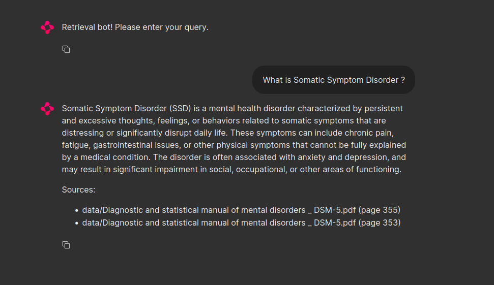

# 🤖📄 PDF Information Retrieval Chatbot 📄🤖

## 🎯 Introduction

The **PDF Information Retrieval Chatbot** is an intelligent tool designed to extract and provide specific information from PDF documents. This project leverages technologies such as **LangChain** for query retrieval and **LLaMA2** for response generation, combined with **FAISS CPU** for fast and efficient searching.

Whether you're working with medical manuals, technical reports, or any other type of PDF document, this chatbot can help you quickly find the information you need. The architecture of this project allows for processing and querying various PDF files, providing a flexible solution for your information retrieval needs.

## 🔍 Features

- **Search within PDFs**: Retrieve specific information from the content of PDF files.
- **LangChain for Query Retrieval**: Uses LangChain to extract relevant information from documents.
- **LLaMA2 for Response Generation**: Generates responses based on the extracted information.
- **FAISS CPU for Indexing**: Uses FAISS for efficient searching without GPU.

## 🚀 Local Execution

1. **Clone the GitHub Repository**:
    ```bash
    git clone https://github.com/bekkaramohamed/Query-Retrieval-Chatbot-for-PDF-files-using-LLaMA2.git
    cd Query-Retrieval-Chatbot-for-PDF-files-using-LLaMA2
    ```

2. **Install Dependencies**:
    ```bash
    pip install -r requirements.txt
    ```
    Download the LLaMA2 Model and put the file in the llama2 folder
    Link for download : https://huggingface.co/TheBloke/Llama-2-7B-Chat-GGML/blob/main/llama-2-7b-chat.ggmlv3.q8_0.bin

3. **Add Your PDF Files**:
    Place your PDF files into the `data` folder of the project.

4. **Data Ingestion**:
    Prepare the PDF files for searching:
    ```bash
    python data_ingestion.py
    ```

5. **Run the Chainlit Application**:
    Start the chatbot to interact with the application:
    ```bash
    chainlit run model.py
    ```

6. **Interact with the Chatbot**:
    Once the Chainlit application is running, you can ask questions through the user interface.

## 📝 Example

To illustrate the chatbot's functionality, we used the PDF file **"Diagnostic and Statistical Manual of Mental Disorders - DSM-5.pdf"**. You can use this file or any other PDF file to test the chatbot.

Here is a screenshot showing the chatbot's user interface in action with a simple query:



